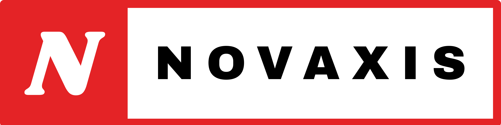
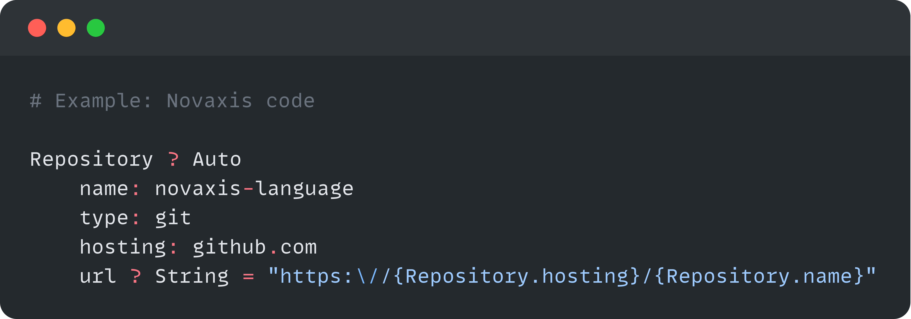

# Novaxis-PHP
Welcome to Novaxis – a sleek and efficient programming language. Experience the ease of use with its simple syntax, allowing you to work faster and smarter. Simplify your coding tasks and unleash your creativity with Novaxis.



## Why Choose Novaxis?
- **Ease of Use**: Novaxis offers a straightforward and intuitive syntax, making it easy for developers of all levels to pick up and start coding quickly.
- **Simplicity**: With a minimalist approach to language design, Novaxis eliminates unnecessary complexities, enabling you to focus on your code's logic and functionality.
- **Versatility**: Novaxis supports a wide range of data structures, making it suitable for various applications, from configuration files to data interchange formats.
- **Readability**: Novaxis's clean and human-readable format ensures that your code is easy to understand and maintain, facilitating collaboration and teamwork.
- **Extensibility**: Built with extensibility in mind, Novaxis allows you to create custom data types and plugins, tailoring the language to your specific needs.


## Getting Started
### To start using Novaxis, follow these simple steps:
- Install the Novaxis interpreter on your system.
- Create a new .novaxis file or open an existing one.
- Write your Novaxis code using the intuitive syntax.
- Execute your code with the Novaxis interpreter to see the results.

## Example code



## Documentation
For comprehensive information on Novaxis's syntax, features, and usage, refer to the [Documentation](https://novaxis-organization.gitbook.io/novaxis-documentation).

## Install
```composer require novaxis-language/novaxis```

## Usage
```PHP
<?php
use Novaxis\Plugins\IntegratedRunner;

$runner = new IntegratedRunner("Test.novaxis");
print_r($runner -> runner());
```

## License

This project is licensed under the [Creative Commons Attribution-NonCommercial-NoDerivatives 4.0 International License (CC BY-NC-ND 4.0)](LICENSE), allowing you to use the language.

## Contact Us

If you have any questions or need assistance, please don't hesitate to contact our support team at [novaxis-language@proton.me](mailto:novaxis-language@proton.me) or join our community forum here.

## Feature Requests and Feedback

Have an idea, feature request, or feedback for Novaxis? Visit our [Canny board](https://novaxis-language.canny.io/novaxis) to submit and vote on ideas, or to leave your feedback.

#### Happy coding with Novaxis! 🚀

---

Copyright © 2023 Novaxis.
